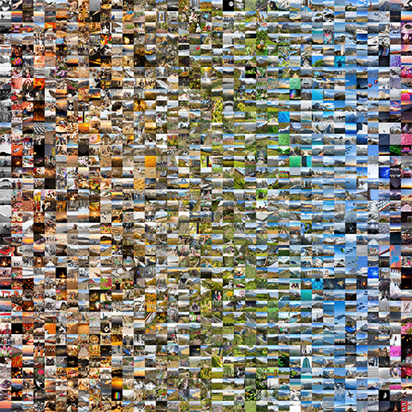

# colorSortedImageGrid

Given a folder of images, sorts them by colour and composites them into a single NxM grid image.



Originally by [Zach Fox](https://github.com/zfox23/colorSortedImageGrid). This version keeps the
original's behaviour and flags, and adds several sorting strategies, an analysis cache, GIF output,
watch and interactive modes, and a rebuilt terminal UI.

## Requirements

Node.js 18 or newer. (The original README asked for v12.18.x; nothing here needs a version that old,
and 12.x has been end-of-life for years.)

## Getting started

```bash
npm install
node index.js --help
```

Put `.jpg`, `.jpeg`, `.png`, `.bmp`, `.tif`, `.tiff` or `.gif` files into `./images`, then:

```bash
node index.js
```

That sorts by hue into a square grid and writes a timestamped PNG into `./output/`.

There are 16 solid-colour test swatches in `./images/test/` for experimenting:

```bash
node index.js -i ./images/test --sortMethod hilbert
```

Not sure what you want? Let it ask:

```bash
node index.js --interactive
```

It prints the equivalent command line at the end, so it doubles as a way to learn the flags.

## Sorting

`--sortMethod` picks the strategy; `--sortParameter` picks the key(s) the numeric and banded
strategies use.

| Method | What it does | When to use it |
| --- | --- | --- |
| `numeric` (default) | Plain sort on one or more keys | Predictable, and the only one that honours multi-key ordering |
| `banded` | Quantises the key into bands, sorts by a secondary key inside each | Fixes the streakiness of a plain hue sort |
| `hilbert` | Orders along a 3D Hilbert curve through CIE Lab | Usually the best-looking overall gradient |
| `perceptual` | Greedy nearest-neighbour walk using CIEDE2000 | Smoothest transitions between neighbours |

Sort keys: `hue`, `saturation`, `value`, `lightness`, `luma`, `labL`, `labA`, `labB`, `dateTaken`,
`filename`.

```bash
# Multiple keys: hue first, brightness breaks the ties
node index.js -p hue,luma

# Reverse anything
node index.js --sortMethod hilbert -d

# Twelve hue bands, brightness within each, flowing continuously across bands
node index.js --sortMethod banded --sortBands 12 --sortSecondary luma --serpentine

# Sort by capture date instead of colour (EXIF, falling back to file mtime)
node index.js -p dateTaken
```

`--sortOrder row-major|column-major` controls how the sorted sequence is laid into the grid. It is
independent of the sort itself.

## Colour analysis

`--colorMethod average` (default) collapses each image to one blended colour — fast, but a
half-red/half-blue image averages to a purple that appears nowhere in it. `--colorMethod dominant`
runs median-cut quantisation and picks the colour covering the most area.

```bash
node index.js --colorMethod dominant -v dominant
```

`--visualizationMode` controls what each cell shows: `normal` (the photo, cropped square), `4x4`
(blocky mosaic), or `dominant` (a flat swatch of the extracted colour).

## Output

```bash
# Explicit path
node index.js -o ./output/grid.png

# Each sorted image as its own numbered file in ./output/
node index.js -o files

# Also export the palette (.json or .css)
node index.js --exportPalette ./output/palette.css

# Framed and spaced out
node index.js --padding 12 --borderWidth 3 --borderColor "#222" --background white
```

`--padding`, `--borderWidth`, `--borderColor` and `--background` accept any CSS colour, including
`transparent`.

## Animation

Sweep one setting across frames and get a single animated GIF — the thing the example GIF above was
originally assembled by hand from three separate runs:

```bash
node index.js --animate --animateOver sortMethod
node index.js --animate --animateOver sortParameter --animateValues hue,luma,saturation --animateDelay 800
```

`--animateOver` accepts `sortParameter`, `sortMethod` or `visualizationMode`. `--animateWidth`
(default 900) keeps the file size sane.

## Other modes

```bash
node index.js --dryRun     # report the plan, including images that will not fit; write nothing
node index.js --watch      # re-render whenever the input folder changes
node index.js --recursive  # include subfolders
```

Under `--watch`, write your output somewhere outside the folder being watched.

## Configuration and presets

Any flags can live in a JSON file; flags on the command line still win.

```bash
node index.js --config ./my-preset.json
```

```json
{
  "sortMethod": "hilbert",
  "visualizationMode": "dominant",
  "pxPerImage": 128,
  "padding": 8,
  "background": "#111111"
}
```

## Performance

Colour analysis is cached per file (keyed on path, size and mtime), so re-running over the same
folder with different sort settings skips the re-analysis. Disable with `--no-cache`; relocate with
`--cacheFile`.

`--concurrency` (defaults to your CPU count, capped at 8) controls how many images are processed in
parallel. Setting `--pxPerImage` explicitly also lowers peak memory, because tiles can be rendered
without waiting to measure every input first.

## Terminal output

`--verbose` adds per-image detail and the full analysis table; `--quiet` leaves only errors and the
output path. After sorting, the colour sequence is printed as a strip of true-colour blocks so you
can judge the gradient without opening the file (`--no-preview` to disable; it is skipped
automatically when output is piped).

## Tests

```bash
npm test
```

## Notes on behaviour that changed

Three bugs in the original are fixed here, and two of them change output you may have relied on:

- **Colour extraction.** The original read the average pixel by slicing a hex string, which
  misaligned whenever the red channel was below 16 — a pure blue image was analysed as
  `(80, 15, 255)` instead of `(5, 0, 255)`. Dark and blue-heavy images therefore sorted to the wrong
  place.
- **`--sortOrder row-major`.** The compositing loop always filled column-by-column and only swapped
  its bounds, so on a square grid `row-major` and `column-major` produced identical output, and on a
  non-square grid `row-major` misplaced images.
- **`.jpeg` files.** The old extension filter was a substring test for `.jpg`, which does not match
  `.jpeg`, so those files were silently ignored. Uppercase extensions were dropped too.

Also: `--sortParameter value` now means HSV value. The original called its conversion HSV but
computed HSL, so `value` was really lightness — still available as the separate `lightness` key.

The original single-file implementation is preserved as `index.original.js.bak`.

## Licence

MIT, as the original.
